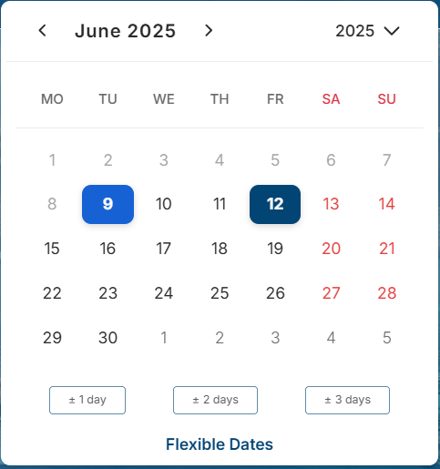
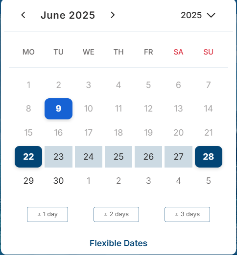

# react-d-calendar

A highly customizable, accessible, and responsive React calendar component for building modern date pickers with ease.

---
## Preview

<p align="center">
  
  
</p>
<p align="center">
  
</p>

Try `react-d-calendar` in action at our [Live Demo](https://dhurka3782.github.io/react-d-calendar-demo).

---

## Features

- **Highly Customizable**: Tailor styles, rendering, and behavior to match your application's design system.
- **Multiple Views**: Seamlessly switch between day, month, year, and decade views.
- **Single & Range Selection**: Support for single date or date range selection with customizable range limits.
- **Accessibility (a11y)**: ARIA-compliant with keyboard navigation and screen reader support.
- **Responsive Design**: Optimized for desktops, tablets, and mobile devices with fluid layouts.
- **Event & Holiday Support**: Display events and holidays with custom styling and rendering.
- **Theming**: Light, dark, and custom themes via CSS variables for consistent branding.
- **Internationalization**: Full locale support for date formats, weekdays, and month names.
- **Performance Optimized**: Leverages React memoization and `react-window` for efficient rendering.
- **Custom Rendering**: Customize headers, footers, tiles, and events with flexible render props.
- **Week Number Display**: Optional week numbers for better usability in scheduling apps.
- **Disable Dates/Years/Months**: Fine-grained control over disabling specific dates, years, or months.
- **Touch Support**: Optimized for touch devices with drag-and-drop range selection.

---

## Installation

### Install via npm:
```bash
npm install react-d-calendar
```

### Or with yarn:
```bash
yarn add react-d-calendar
```
---

## Quick Start

### Basic Usage

```jsx
import React from 'react';
import { Calendar } from 'react-d-calendar';
import 'react-d-calendar/dist/styles.css';

function App() {
  const handleDateSelect = (date) => {
    console.log('Selected date:', date.toDateString());
  };

  return <Calendar onDateSelect={handleDateSelect} />;
}

export default App;
```

### Customizing Day Rendering
#### Customize the appearance of individual days:

```jsx
import React from 'react';
import { Calendar } from 'react-d-calendar';
import 'react-d-calendar/dist/styles.css';

function App() {
  const customDay = ({ date }) => (
    <div style={{ color: date.getDate() % 2 === 0 ? 'blue' : 'red' }}>
      {date.getDate()}
    </div>
  );

  return (
    <Calendar
      onDateSelect={(date) => alert(date.toDateString())}
      tileContent={customDay}
      style={{ border: '1px solid #ccc', padding: '10px' }}
    />
  );
}

export default App;
```

### Range Selection with Events
#### Enable range selection and display events:

```jsx
import React from 'react';
import { Calendar } from 'react-d-calendar';
import 'react-d-calendar/dist/styles.css';

function App() {
  const events = [
    { 
      date: new Date(2025, 5, 10), 
      title: 'Team Meeting', 
      type: 'meeting', 
      color: '#22c55e' 
    },
    { 
      date: new Date(2025, 5, 15), 
      title: 'Holiday', 
      type: 'holiday', 
      color: '#f43f5e' 
    },
  ];

  return (
    <Calendar
      selectionMode="range"
      events={events}
      onDateSelect={(range) => console.log('Selected range:', range)}
      customTheme={{ primary: '#4b6cb7', accent: '#48bb78' }}
    />
  );
}

export default App;
```
### Custom Day Rendering

```jsx
import React from 'react';
import { Calendar } from 'react-d-calendar';
import 'react-d-calendar/dist/styles.css';

function App() {
  const tileContent = ({ date }) => (
    <div style={{ color: date.getDate() % 2 === 0 ? 'blue' : 'red' }}>
      {date.getDate()}
    </div>
  );

  return (
    <Calendar
      onChange={(date) => alert(date.toDateString())}
      tileContent={tileContent}
      style={{ border: '1px solid #ccc', padding: '16px', borderRadius: '8px' }}
    />
  );
}

export default App;
```
### Custom Footer with Selected Date

```jsx
import React from 'react';
import { Calendar } from 'react-d-calendar';
import 'react-d-calendar/dist/styles.css';

function App() {
  const renderCustomFooter = ({ selectedValue }) => (
    <div style={{ padding: '12px', textAlign: 'center', fontSize: '14px' }}>
      Selected: {selectedValue ? (Array.isArray(selectedValue) ? `${selectedValue[0].toDateString()} - ${selectedValue[1].toDateString()}` : selectedValue.toDateString()) : 'None'}
    </div>
  );

  return (
    <Calendar
      selectionMode="range"
      renderCustomFooter={renderCustomFooter}
      onChange={(range) => console.log('Selected:', range)}
    />
  );
}

export default App;
```
---


## Props
### Below is a comprehensive list of props supported by react-d-calendar. For detailed usage, refer to the [Wiki](https://github.com/dhurka3782/react-d-calendar/wiki).

| Prop                   | Type                                     | Default        | Description                                |
| ---------------------- | ---------------------------------------- | -------------- | ------------------------------------------ |
| `date`                 | `Date`                                   | `new Date()`   | Initial date to display.                   |
| `activeStartDate`      | `Date`                                   | `undefined`    | Controlled start date for the calendar view. |
| `defaultActiveStartDate` | `Date`                                 | `undefined`    | Default start date if `activeStartDate` is not provided. |
| `value`                | `Date \| [Date, Date]`                   | `undefined`    | Controlled selected date or range.         |
| `defaultValue`         | `Date \| [Date, Date]`                   | `undefined`    | Default selected date or range if `value` is not provided. |
| `defaultView`          | `'day' \| 'month' \| 'year' \| 'decade'` | `'month'`      | Initial view mode.                         |
| `disableDate`          | `(date: Date) => boolean`                | `undefined`    | Function to disable specific dates.        |
| `disableYear`          | `(year: number) => boolean`              | `undefined`    | Function to disable specific years.        |
| `disableMonth`         | `(monthDate: Date) => boolean`           | `undefined`    | Function to disable specific months.       |
| `onChange`             | `(value: Date \| [Date, Date]) => void`  | `undefined`    | Callback for date or range selection.      |
| `onClickMonth`         | `(date: Date) => void`                   | `undefined`    | Callback when a month is clicked.          |
| `onClickWeekNumber`    | `(week: number, date: Date) => void`     | `undefined`    | Callback when a week number is clicked.    |
| `onActiveStartDateChange` | `({ activeStartDate }: { activeStartDate: Date }) => void` | `undefined` | Callback for active start date changes. |
| `onViewChange`         | `({ view }: { view: 'day' \| 'month' \| 'year' \| 'decade' }) => void` | `undefined` | Callback for view changes. |
| `onDrillDown`          | `() => void`                             | `undefined`    | Callback when drilling down (e.g., month to day). |
| `onDrillUp`            | `() => void`                             | `undefined`    | Callback when drilling up (e.g., day to month). |
| `onRangeHover`         | `({ start, end }: { start: Date; end: Date \| null }) => void` | `undefined` | Callback for range hover events. |
| `tileClassName`        | `({ date, view }: { date: Date; view: string }) => string \| null` | `undefined` | Add custom classes to tiles. |
| `tileContent`          | `({ date, view, event }) => ReactNode`   | `undefined`    | Custom content for tiles.                  |
| `tileDisabled`         | `({ date }: { date: Date }) => boolean`  | `undefined`    | Disable specific tiles.                    |
| `customTileContent`    | `({ date, view, event }) => ReactNode`   | `undefined`    | Custom tile content for specific views.    |
| `onDateSelect`         | `function`                               | `() => {}`     | Callback when a date or range is selected. |
| `selectionMode`        | `'single' \| 'range'`                    | `'single'`     | Date selection mode.                       |
| `events`               | `Array<{ date, title?, type?, color? }>` | `[]`           | Events to display.                         |
| `renderEvent`          | `function`                               | `() => null`   | Custom render function for events.         |
| `tileContent`          | `function`                               | `undefined`    | Custom day tile content.                   |
| `tileClassName`        | `function`                               | `undefined`    | Add custom class to days.                  |
| `tileDisabled`         | `function`                               | `undefined`    | Disable specific dates.                    |
| `locale`               | `string`                                 | `'en-US'`      | Date formatting locale.                    |
| `dateFormat`           | `'mm/dd/yyyy' \| ...`                    | `'mm/dd/yyyy'` | Date format for display.                   |
| `weekdayFormat`        | `'short' \| 'full' \| 'minimal'`         | `'short'`      | Weekday label format.                      |
| `showDoubleView`       | `boolean`                                | `false`        | Show two months side-by-side.              |
| `showWeekNumbers`      | `boolean`                                | `false`        | Show week numbers.                         |
| `showNeighboringMonth` | `boolean`                                | `true`         | Show adjacent month days.                  |
| `defaultView`          | `'day' \| 'month' \| ...`                | `'month'`      | Initial view mode.                         |
| `maxDetail`            | `'day' \| 'month' \| ...`                | `'month'`      | Maximum zoom level.                        |
| `minDetail`            | `'day' \| 'month' \| ...`                | `'year'`       | Minimum zoom level.                        |
| `theme`                | `'light' \| 'dark'`                      | `'light'`      | Theme mode.                                |
| `customTheme`          | `object`                                 | `{}`           | Custom CSS variables.                      |
| `style`                | `object`                                 | `{}`           | Inline styles.                             |
| `className`            | `string`                                 | `''`           | Additional container class.                |
| `holidayDates`         | `Array<Date>`                            | `[]`           | Highlighted holidays.                      |
| `weekStartDay`         | `number`                                 | `1`            | Week start day (0 = Sunday).               |
| `onClickEvent`         | `function`                               | `undefined`    | Event click callback.                      |
| `selectOnEventClick`   | `boolean`                                | `true`         | Select date on event click.                |

---

## Customization
### Theming
#### Customize the calendar's appearance using the customTheme prop:
```jsx
<Calendar
  customTheme={{
    'background-color': '#1a202c',
    'text-color': '#e2e8f0',
    'primary-color': '#63b3ed',
    'accent-color': '#68d391',
  }}
/>
```
### Custom Styles
#### Add custom styles via CSS variables or classes:
```css
.calendar {
  --primary-color: #2a4365;
  --accent-color: #22c55e;
}

.custom-calendar .calendar-day:hover {
  background-color: #f0f4f8;
  transform: scale(1.1);
}
```
```jsx
<Calendar className="calendar" />
```
### Custom Event Rendering
#### Customize event indicators:
```jsx
const renderEvent = ({ event, date }) => (
  <span className="custom-event" style={{ backgroundColor: event.color, padding: '2px 6px', borderRadius: '4px' }}>
    {event.title}
  </span>
);

<Calendar events={events} renderEvent={renderEvent} />
```
### Custom Header
#### Customize the header:
```jsx
const renderHeader = ({ date, onChange, view }) => (
  <div style={{ display: 'flex', justifyContent: 'space-between', padding: '12px' }}>
    <button onClick={() => onChange(new Date(date.setMonth(date.getMonth() - 1)))}>Prev</button>
    <span>{date.toLocaleString('en-US', { month: 'long', year: 'numeric' })}</span>
    <button onClick={() => onChange(new Date(date.setMonth(date.getMonth() + 1)))}>Next</button>
  </div>
);

<Calendar renderHeader={renderHeader} />
```

###  Disabling Dates
#### Disable specific dates or ranges:
```jsx
<Calendar
  disableDate={(date) => date.getDay() === 0} // Disable Sundays
  customDisabledDates={[new Date(2025, 5, 10)]}
  disableBeforeToday={true}
/>
```
---

## Development
### Setup
#### Clone the repository:
```bash
git clone https://github.com/dhurka3782/react-d-calendar.git
cd react-d-calendar
```
#### Install dependencies:
```bash
npm install
```
#### Building
```bash
npm run build
```
#### Testing
```bash
npm test
```
---
## Contributing
### We welcome contributions! Follow these steps:

- Fork the repository.
- Create a feature branch  ``` git checkout -b feature/new-feature ``` .
- Commit your changes ``` git commit -m 'Add new feature ```.
- Push to the branch ``` git push origin feature/new-feature ```.
- Open a Pull Request with a detailed description.

### Guidelines
- Adhere to [ESLint](https://eslint.org/) and [Prettier](https://prettier.io/) standards.
- Write tests for new features or bug fixes using Jest.
- Update documentation in the wiki for new features.
- Ensure accessibility compliance (e.g., ARIA labels, keyboard support).
---

## Support
### For questions, bugs, or feature requests, please open an issue on [GitHub](https://github.com/dhurka3782/react-d-calendar/issues).
---
## License

### This project is licensed under the [MIT License](./LICENSE).
---

## Resources

- [Documentation](https://github.com/dhurka3782/react-d-calendar/wiki)
- [Live Demo](https://dhurka3782.github.io/react-d-calendar-demo)
- [GitHub Repository](https://github.com/dhurka3782/react-d-calendar)

---

   ### Made with ❤️ by the React-D-Calendar team
